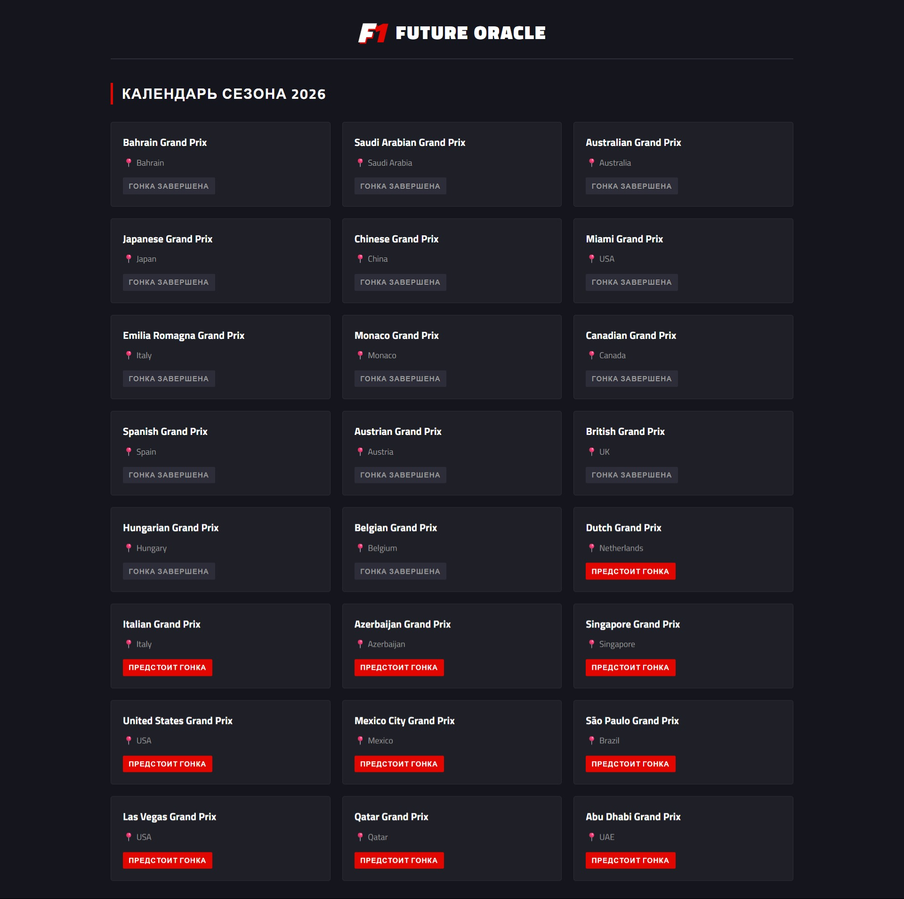
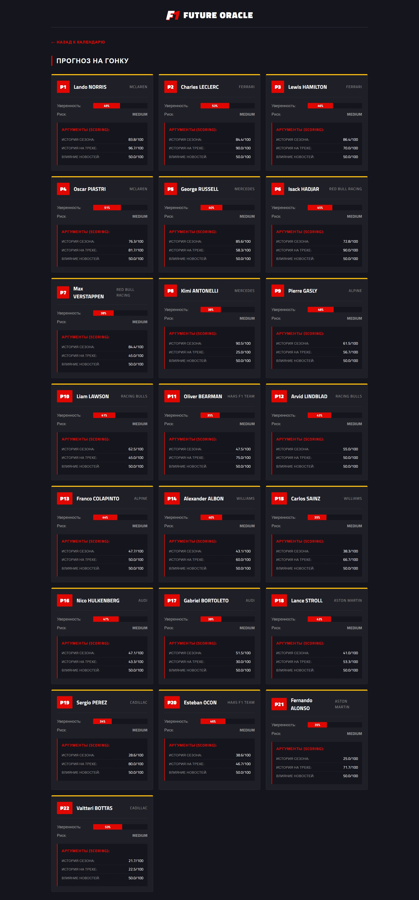
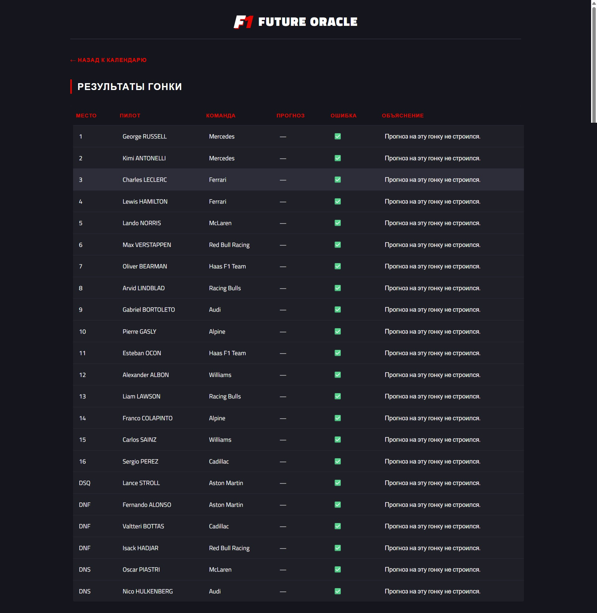
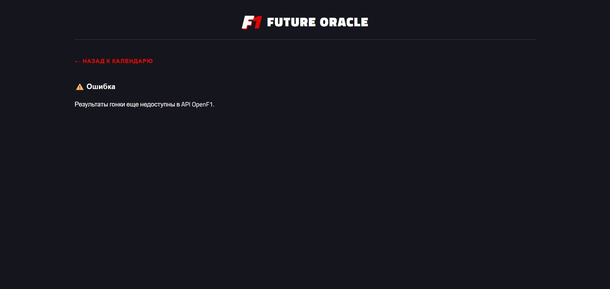

# F1 Predictor (Formula 1 Future Oracle) 🏎️

**Тема:** Прогнозирование результатов Гран-при Формулы 1.
**Стек:** Spring Boot (Java 17), PostgreSQL, React (Vite), Python (TextBlob), Docker, Liquibase, Testcontainers.

## Как запустить

1. Убедитесь, что на вашем компьютере установлен **Docker Desktop**.

2. Клонируйте репозиторий:

   ```bash
   git clone https://github.com/Zaremau/f1-future-oracle.git
   ```

3. Перейдите в папку проекта и запустите сборку:

   ```bash
   docker compose up --build
   ```
4. Дождитесь инициализации базы данных и загрузки исторических данных (занимает около 10-15 секунд).
5. Откройте браузер и перейдите по адресу: `http://localhost:3000`
6. Бэкенд API доступен на: `http://localhost:8080`

## Источники данных
1. **OpenF1 API** (`https://api.openf1.org/v1/`): Получение реального расписания сессий, результатов практик, квалификаций и гонок.
2. **RSS Feeds**: `motorsport.com` и `formel1.de`. Парсинг новостей, анализ тональности (Python+TextBlob) и поиск ключевых слов риска (Java Regex).

## Как устроена база данных
Используется PostgreSQL. Схема накатывается через Liquibase (`ddl-auto: none`).
Таблицы: `drivers`, `grands_prix`, `news`, `historical_results`, `practice_results`, `qualifying_results`, `predictions`, `actual_results`.

Особенности хранения:
* В таблице `news` хранится `raw_xml` (сырые данные RSS) и нормализованные показатели (`sentiment_score`, `risk_keywords`, `mentioned_drivers`).
* В таблице `predictions` аргументы прогноза сохраняются в формате `jsonb` для удобной передачи на фронтенд.
* В таблице `actual_results` хранится `error_margin` и `error_type` (тип ошибки прогноза).

## Как работает алгоритм (Scoring)
Прогноз строится на основе взвешенной модели скоринга (от 0 до 100). Система синхронизируется с текущим временем и учитывает стадию уикенда:

1. **До уикенда (UPCOMING):** 50% вес истории пилота в сезоне + 20% история на треке + 30% вес новостей (sentiment).
2. **После практик (FP_DONE):** 30% скилл + 10% история трека + 20% новости + 40% темп в практике (gap to P1).
3. **После квалификации (QUALI_DONE):** 20% скилл + 10% трек + 10% новости + 20% темп + 40% позиция на старте (Grid Score).

* **Штрафы:** Если в новостях найдены ключи риска (engine penalty, crash, rain), скор понижается на 15 пунктов.
* **Уверенность (Confidence):** Рассчитывается динамически. Базовое значение зависит от стадии, увеличивается при наличии реальных данных и высокой оценке, снижается при противоречивых данных (вычисляется через стандартное отклонение).
* **Риск (Risk):** `HIGH`, если есть штрафы или плохая стартовая позиция (ниже 15-го места).

### Как сходятся цифры (Пример)
Если у пилота среднее место в сезоне = 1 (Score = 100), история на треке = 3 (Score = 90), а новости нейтральные (Score = 50):
`Score = (100 * 0.5) + (90 * 0.2) + (50 * 0.3) = 50 + 18 + 15 = 83.0/100`
На фронтенде в карточке прогноза можно увидеть, как каждый из этих показателей повлиял на итоговый балл.

## Объяснимый ИИ (Explainable AI)
Система умеет объяснять свои ошибки. После завершения гонки (`RACE_DONE`) фронтенд запрашивает реальные результаты. Система:
1. Сравнивает `predicted_position` (прогноз) с `final_position` (реальный результат).
2. Вычисляет `error_margin` (на сколько мест ошиблась).
3. Определяет тип ошибки: `OVERESTIMATED` (завысила результат) или `UNDERESTIMATED` (занизила результат).
4. Выводит пользователю таблицу с результатами и текстовым объяснением ошибки.

## Что использовали из AI
Для анализа тональности новостей используется Python-скрипт (`python-sentiment/sentiment.py`) с библиотекой `TextBlob`. Бэкенд (Spring Boot) вызывает этот скрипт через `ProcessBuilder`, передавая заголовок новости, и получает обратно оценку от `-1.0` (негативная) до `1.0` (позитивная).

## Архитектурные заметки (Trade-offs)
В рамках прототипа для ускорения разработки в сервисе `OpenF1Service` методы загрузки данных из внешнего API и сохранения их в БД объединены в один метод с аннотацией `@Transactional`. 

В реальном production-приложении я бы разделила эту логику:
1. Слой интеграции (Adapter) скачивал бы данные из API в асинхронном режиме (или по расписанию) и клал их в очередь (Kafka/RabbitMQ).
2. Слой персистенции читал бы данные из очереди и сохранял в БД в короткой, изолированной транзакции.
Это позволило бы избежать удержания соединений с базой данных во время долгих сетевых вызовов к OpenF1.

## Скриншоты интерфейса

**1. Главная страница (Календарь Гран-при)**


**2. Карточка прогноза (Уверенность, риск, аргументы)**


**3. Результаты прошедшей гонки (Подсчет ошибки)**


**4. Ошибка, когда данные отсутствуют**


## Отказ от ответственности
Прототип создан в аналитических и развлекательных целях. Не связан с реальными ставками и не гарантирует доходность.

